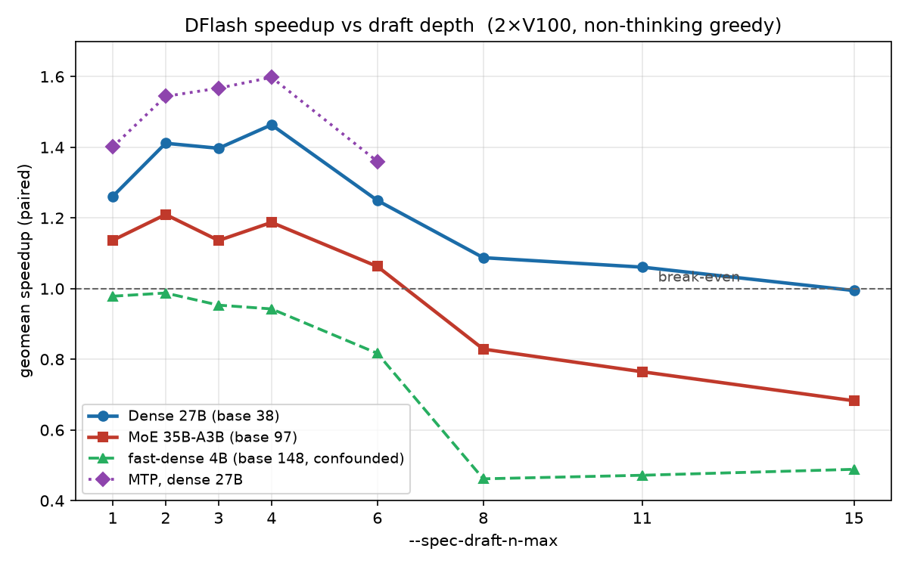
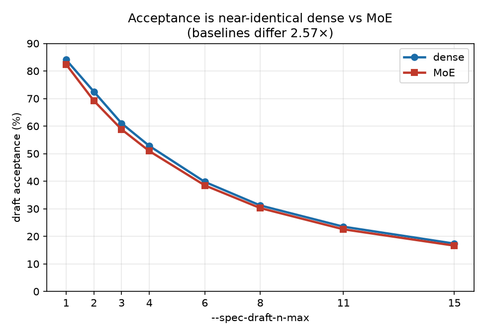
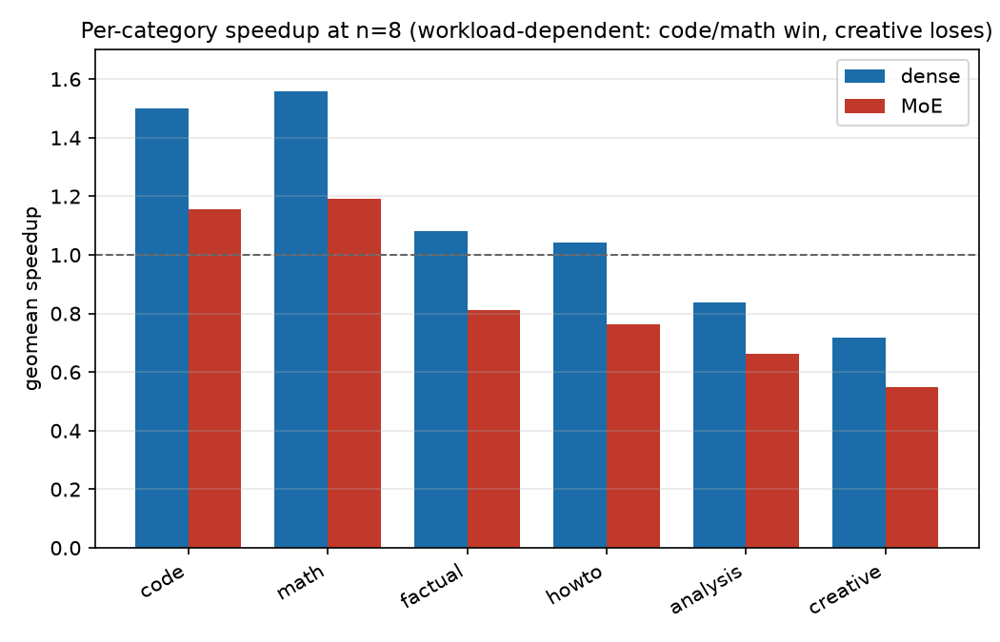
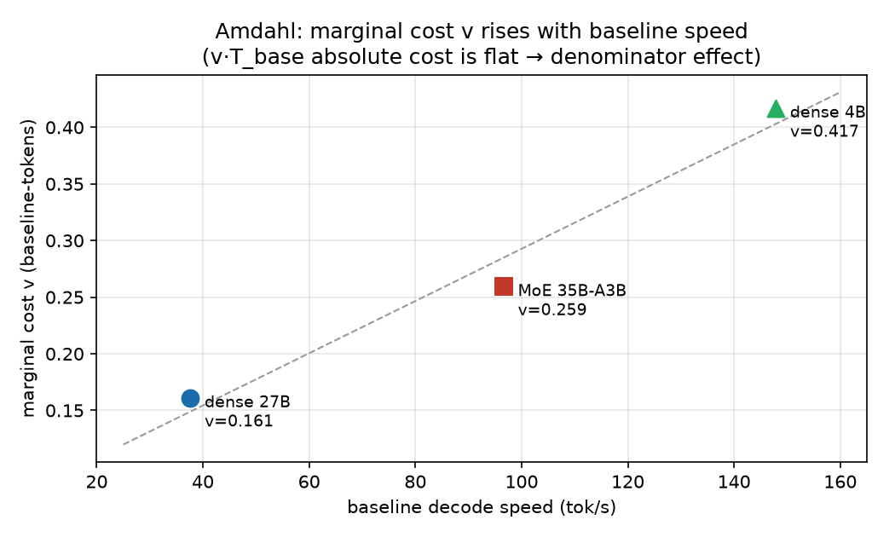

# DFlash speculative decoding on 2× V100 — a controlled dense-vs-MoE sweep

A single-rig, quant-matched benchmark of [DFlash](https://z-lab.ai/projects/dflash/) speculative decoding
([llama.cpp PR #22105](https://github.com/ggml-org/llama.cpp/pull/22105),
[issue #25117](https://github.com/ggml-org/llama.cpp/issues/25117)) on **2× Tesla V100 32 GB (sm_70)**,
comparing a **dense** and an **MoE** target at **matched quantization**, with a fast-dense control and an MTP comparison.

> **Scope.** Every number here is **V100-class only** (sm_70, ~900 GB/s, weak low-precision compute) and should **not** be
> extrapolated to other hardware — speedups and the crossover point are bandwidth-dependent (the PR author reports 2.69× for
> the same dense model on a DGX Spark; this rig gives ~1.46×). Measurements are throughput only; **output quality was not evaluated.**

## TL;DR (all independently reproduced — `python scripts/analyze.py`)

- On this rig, DFlash speedup **peaks at a low `--spec-draft-n-max` (n≈2–4)** and **erodes as n grows**, for **both** dense and MoE.
- **MoE crosses into net-loss earlier** (robust net-loss by n8) than dense (which stays net-neutral — CI includes 1.0 — through n15). Consistent with @jschmied's "3–4 was the peak" and @HH1162's "n=16 no speedup".
- **Draft acceptance is near-identical between dense and MoE** at every n (dense marginally higher, +0.7 to +3.3 pp), while baselines differ **2.57×** (37.6 vs 96.6 tok/s). So — for a **cleanly-quantized** MoE — the MoE weakness here is **not** a draft-acceptance problem; it is on the throughput/overhead side.
- **MTP > DFlash across the swept range** on the dense target (e.g. n4: MTP 1.60× vs DFlash 1.46×), matching @gelim (V100 dense) and @jerrydong1988 (Strix-Halo MoE), now as a full sweep.
- **Thinking traces draft *better*** than concise answer tokens, so the non-thinking (chat) numbers here are a *lower bound* for reasoning-heavy use.
- `temp 0.7` ≈ greedy (≤3% penalty; crossover unchanged).

**Mechanism (hypothesis, not a measured mechanism).** The acceptance-equal-but-different-speedup gap is consistent with an
**Amdahl effect on the drafter**: MoE's per-token decode is ~2.57× cheaper (A3B sparsity), so the same drafter+verify overhead is a
larger *fraction* of its budget and it crosses to net-loss at lower n. A cost fit `C(n)=τ/speedup≈d+v·n` has a **near-equal fixed
intercept** (d≈1.5 for both) but a **marginal cost `v` that rises with baseline speed** (0.16 dense / 0.26 MoE, pooled-τ). **Expert
activation counts were not measured, so this neither tests nor excludes the expert-union mechanism in the PR description** — it only
shows the dense-vs-MoE ordering can be reproduced without it. A fast dense model (Qwen3-4B) also crosses hard, but that control mixes
single-GPU vs 2-GPU placement and a lower-acceptance self-converted drafter, so it is **suggestive only**.

## Figures

**Speedup vs draft depth** — both architectures peak at low `n` and erode; the MoE (faster baseline) crosses break-even earlier; MTP dominates DFlash across the swept range.



**Left:** draft acceptance is near-identical dense vs MoE (the de-confounder). **Right:** per-category speedup is workload-dependent.

 

**Mechanism (hypothesis):** the marginal per-step cost `v` (in baseline-token units) rises with baseline decode speed across three models — an Amdahl/denominator effect, not a growing per-step cost (the fast-dense 4B point is confounded; see caveats).



## Headline tables

Full tables with 95 % bootstrap CIs and per-category breakdowns: [`results/summary_tables.md`](results/summary_tables.md)
(regenerated by `scripts/analyze.py`). Summary:

**DFlash speedup vs `--spec-draft-n-max` (geomean [95 % CI], non-thinking greedy, matched IQ4_XS + Q8_0 drafter):**

| n-max | Dense-27B (base 37.6) | MoE-35B-A3B (base 96.6) |
|---|---|---|
| 1 | 1.26 | 1.14 |
| 2 | 1.41 | **1.21** |
| 3 | 1.40 | 1.14 |
| 4 | **1.46** | 1.19 |
| 6 | 1.25 | 1.06 [0.97, 1.16] |
| 8 | 1.09 [0.99, 1.20] | **0.83** [0.75, 0.91] |
| 11 | 1.06 [0.95, 1.18] | 0.77 |
| 15 | 0.995 [0.89, 1.11] | 0.68 [0.61, 0.77] |

Per-category speedup **varies widely by workload** (code/math draft well ~1.5×; creative/free-form poorly ~0.6×), so a single "average speedup" depends on the prompt mix — see the per-category tables.

## Repository layout

```
data/raw/{camp3,campfd2,camp3t,campt07,campmtp2}/   full per-request JSON (timings + generated text)
data/distilled/all_records.csv                      analysis-ready flat table (timings only)
prompts/prompts40.json                              the 40 prompts (6 categories)
scripts/analyze.py                                  reproduces every number -> results/summary_tables.md
scripts/distill.py                                  raw JSON -> CSV
scripts/run_*.sh                                    the benchmark harnesses (see METHODOLOGY.md)
results/summary_tables.md                           generated tables (geomean/median/CI/%loss/acceptance/cost-fit/per-category/losslessness)
METHODOLOGY.md                                      hardware, build toolchain, exact commands, metric definitions, caveats
```

`data/raw/` maps to the phases: `camp3`=main sweep, `campfd2`=fast-dense control, `camp3t`=thinking regime,
`campt07`=temp 0.7, `campmtp2`=MTP.

## Reproduce

Analysis only (no GPU needed):
```bash
python scripts/analyze.py            # -> results/summary_tables.md
python scripts/distill.py > data/distilled/all_records.csv
```
Re-run the benchmarks: see [`METHODOLOGY.md`](METHODOLOGY.md) for the exact `llama.cpp b9860` build (sm_70), model list, and
`llama-server` commands. The harnesses are in `scripts/run_*.sh`.

## Credits

This is a datapoint alongside prior thread contributors, not a correction of anyone:
@ruixiang63 (the PR + benchmark tables + the expert-union hypothesis + the DGX-Spark numbers),
@andyskw (the first dense-27B `--draft-max` sweep, on an iGPU),
@gelim (V100 dense MTP-vs-DFlash),
@jschmied (low-n peak on Qwen3-Coder-Next),
@HH1162 (MoE `--draft-max 16` no-speedup),
@jerrydong1988 (the original #25117 MoE regression report).

## Author & license

Hsiu-Chi Tsai (`thc1006`). Code: MIT. Data/results (JSON, CSV): CC0.
